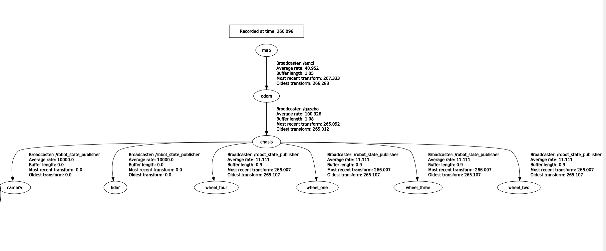
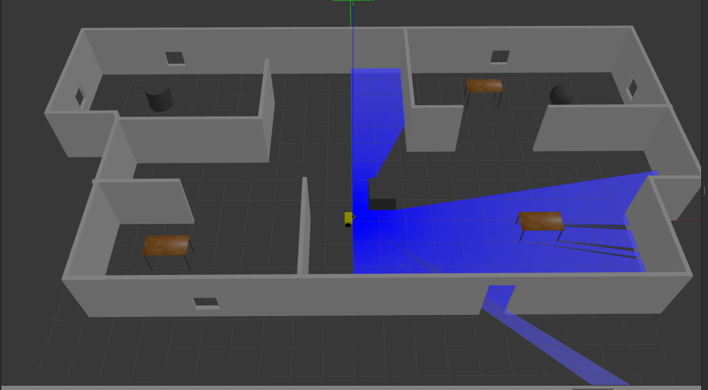

# Autonomous_Mobile_Robot
## Descreption 
This autonomous mobile robot design was built using the Unified Robot Description Format (URDF) and it utilizes a skid steer drive system.

To facilitate mapping and navigation, I implemented the gmapping package, which employs laser-based SLAM (Simultaneous Localization and Mapping) techniques to generate a 2D occupancy grid map.

For accurate localization in a 2D environment, the robot employs AMCL, a probabilistic localization system.

Furthermore, the robot's navigation capabilities are powered by a comprehensive navigation stack. This stack integrates data from odometry, sensor feeds, and a designated goal pose. It then generates safe velocity commands, which are subsequently transmitted to the mobile base via the move_base package.

## Robot rqt_tf_tree of frames


## Getting started 
```
cd catkin_ws/src
git clone https://github.com/your-username/autonomous_robot.git
git clone https://github.com/ros-perception/slam_gmapping.git
git clone https://github.com/ros-planning/navigation.git
cd ..
catkin_make
source devel/setup.bash
```
## Running robot in gazebo
```
roslaunch okasha_gazebo okasha_gazebo.launch
```


## Creating a map
```
roslaunch gmapping slam_gmapping_pr2.launch 
```
## Saving the map
```
 rosrun map_server map_saver 
```
## Running navigtion in Rviz
this launch file will launch Amcl,move_base,Map server and rviz 
```
roslaunch okasha_navigation okasha_navigation.launch 
```


## Autonomous_Mobile_Robot video

[Autonomous Mobile Robot video](https://youtu.be/IF3Fd8DPQEA)


